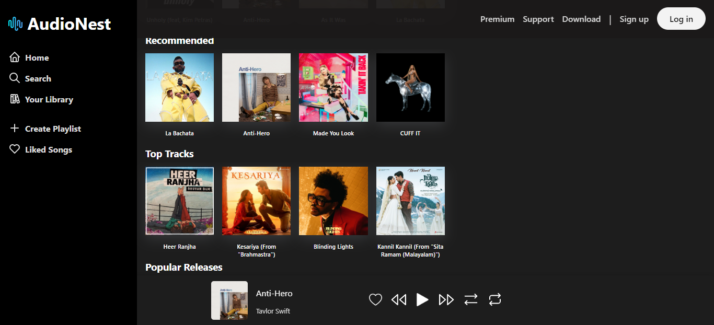
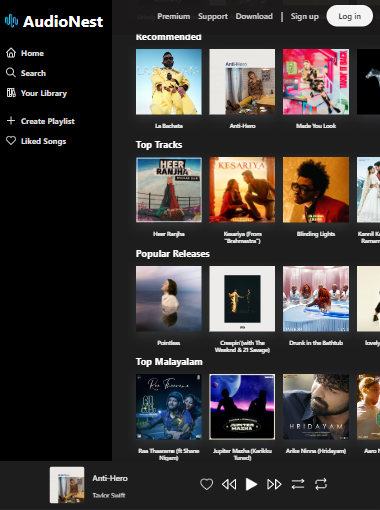
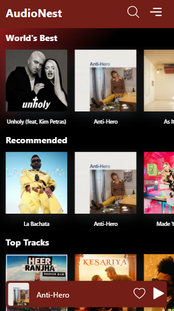

# AudioNest
AudioNest is a web-based music streaming service. It is entirely developed with Vanilla JS / CSS / HTML and employs JSON Server as a database and Firebase storage as a CDN for music streaming.

## Technologies used:
* HTML
* CSS 
* JS 
* JSON Server
* Firebase

## Project Live Link:
[AudioNest](https://audionest.netlify.app/)

## JSON Server Link:
[JSON Server](https://audionest-web-api.onrender.com/)

## JSON Server GitHub Repo:
[JSON Server (GitHub Link)](https://github.com/iamnazeef/AudioNest-JSON-Server)

## How to run locally?
```
//Clone the repo
git clone https://github.com/iamnazeef/AudioNest

//Open index.html file on any web browser
```
## Screenshots

### Desktop view


### Tablet view


### Mobile view
* 
